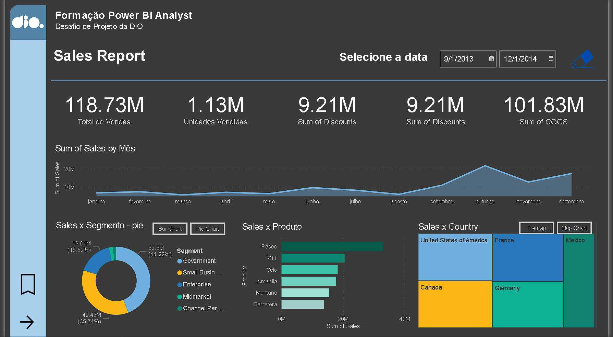
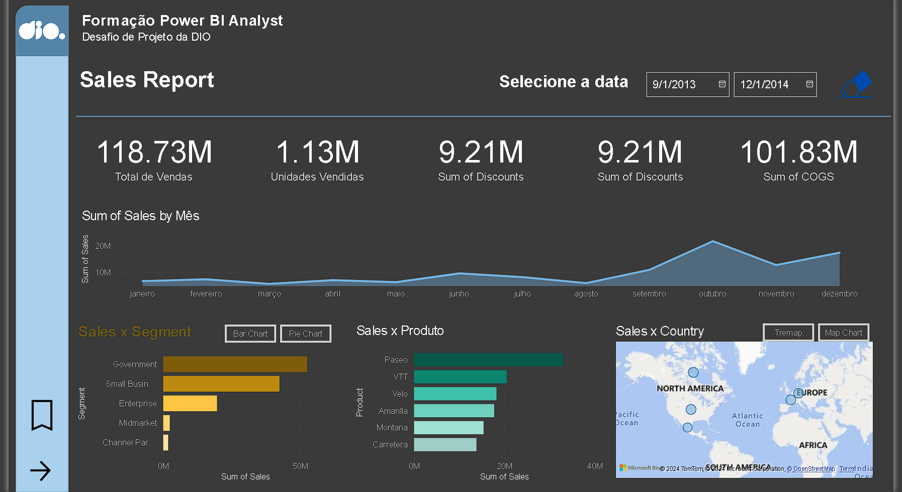
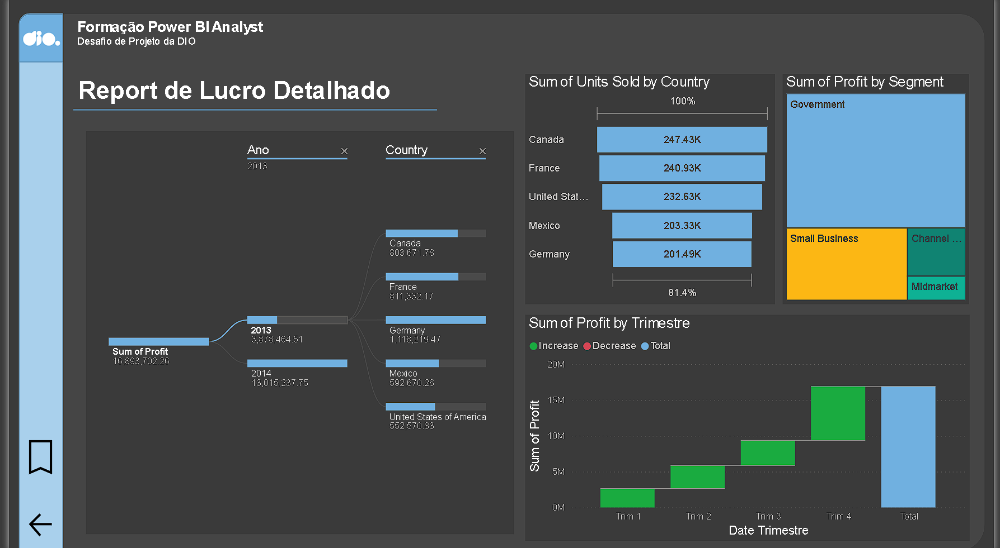
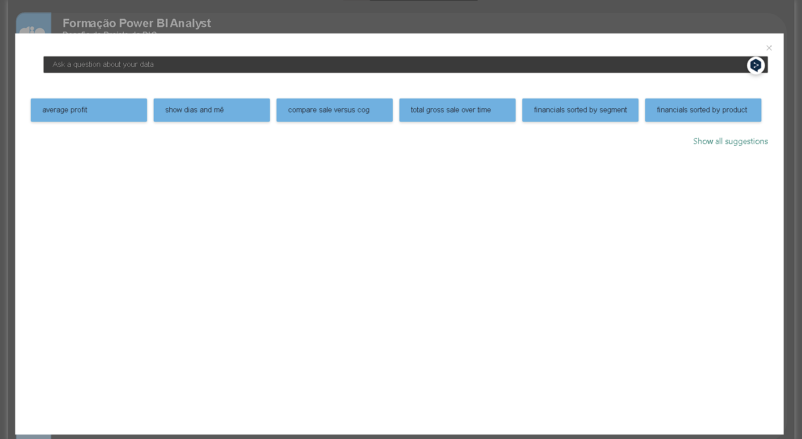

# Introdução

A seguir será apresentado um relatório de vendas utilizando o banco de dados Sample Sales. O relatório foi feito durante o curso de formação de Data Analitics na plataforma DIO.

O relatório foi criado pensando em uma estrutura bem definida que atendesse aos desejos de analise de desempenho e lucros da empresa contendo funções como botões de navegação que fornecem navegabilidade, segmentadores, botões com imagem associado, entre outros. 

# Features
- Na primeira pagina do relatorio é possivel analisar o desempenho geral das vendas por periodo, 
- É possível ainda realizar filtros por data, facilitando a analise das vendas de cada produto, país e segmento.

- No canto inferior existem botões clicáveis que permitem a troca de gráficos de maneira a facilitar a visualização do analista.

- No canto inferior esquerdo é possível encontrar uma seta que levará a uma segunda página do relatório.

- Na segunda página do relatório encontramos informações sobre os lucros da empresa, podendo ser visualizado especificamente por país e ano, categorias, trimestre além das unidades vendidas por país.

- Ademais ainda é possivel utilizar o Q&A do power BI ao clicar no bookmark no canto inferior esquerdo(acima da seta), para obter gráficos especificos de acordo com o desejo do analista.

